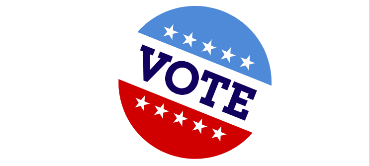
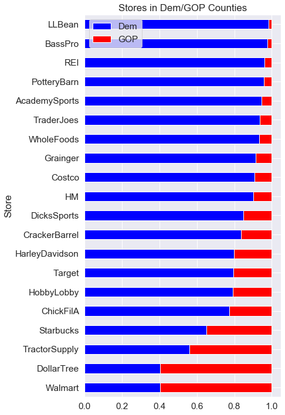
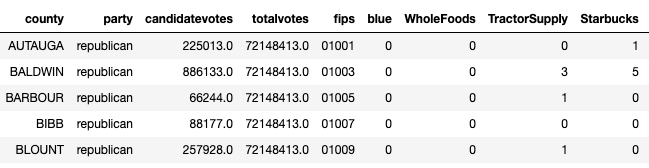
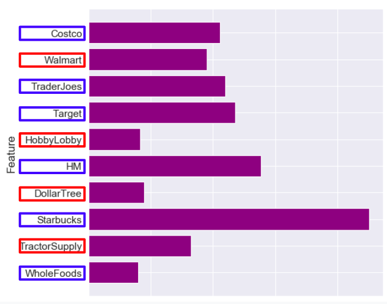
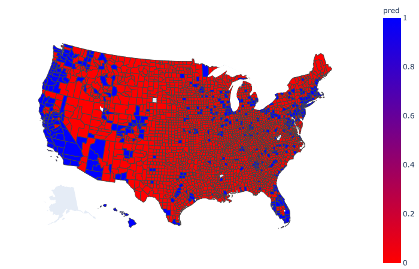
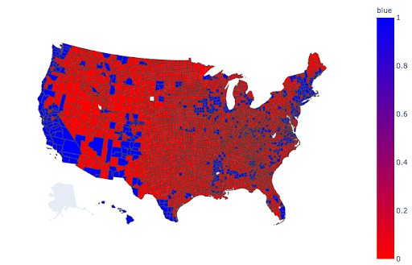

# Classifying Party Politics by the Presence of Chain Stores

* Blog post 1: https://medium.com/@sciencelee/are-you-a-trader-joes-democrat-or-a-walmart-republican-a7b156131435 
* Blog post 2: https://medium.com/@sciencelee/simple-example-using-boruta-feature-selection-in-python-8b96925d5d7a
* Presentation: https://docs.google.com/presentation/d/1L76n1nCFUE_kYPezSsDZK-VQRnlahtwcVJXMh2_9JbU/edit?usp=sharing
* Presentation video: https://www.youtube.com/watch?v=2Y-F5O8FyRg

## Overview
The chain stores found in a community can tell us a lot about the people that live there. Think about Target and Walmart; what political party do you associate with each? I wanted to investigate that perception, so I built an election model based solely on the number of chain stores in an area.

My hypothesis is that the number of total chain stores can predict Democratic and Republican winners in political districts significantly better than guessing. Additionally, the particular chain store/brand will be an indicator of Republican or Democratic winners.

## Big Questions
* How accurately can we predict party voting using only chain stores?
* What stores have the greatest influence on our model?
* What stores trend Democratic or Republican?
* How do we apply this model toward future elections?

## Content of This Project
1. [Scraping and data gathering](http://url)
2. [County feature building](http://url)
3. [Final election model](http://url)

Additionally, the original and engineered datasets are located in the /datasets folder in this repo.

## Our Data

Our data investigates over 3000 US counties and over 45,000 retail location from 20 store chains.

**We built a single dataset which contains the following columns:**
- County FIPS code (used as the index)
- Number of stores in the county
- Election result (Democrat/Republican)
- County Area
- County Population 

**Before building our single dataset for our model, we must also compile and use:**
- Data containing every location of 20 national chain stores 
- Political boundary maps for counties and/or congressional districts US 
- Results of 2018 midterm election 
- Population and area of every county and congressional district with FIPS codes

**Resources**: 
- Kaggle (Walmart, Starbucks, Target)
- POI Factory website (Dollar Tree, Target, Harley Davidson, REI, Chick-Fil-A, Hobby Lobby, Bass Pro, Costco, Dick's, Academy)
- Web Scraping (H&M, Cracker Barrel, Tractor Supply Co., Trader Joe's, Pottery Barn, LL Bean, Grainger) 
- MIT Election Lab (2018 Midterm election results by county)
- data.gov (population, area, FIPS codes, shape files)  

## Creating our Dataset

This was the most time consuming part of the project.  The data must be compiled from disparate sources and engineered into a single dataset suitable for our model.

**Our Process for Building Dataset**
1. Gather all of our store, geodata, and county data using existing datasets and scraping. 
2. Create a dataFrame with our polling data, and determine political party for each county.
3. Add in columns for population and area of each county from data.gov data, and match up FIPS data used for mapping.
4. Go through each of our 20 store datasets, and find the number of stores in each district.  Add it to our dataset
5. Write all relevent data to file.

The graphic below shows the 20 store features selected for this project and the relative party distribution.

## Scaling

When compiled, our dataset contains the number of stores in each county

To make the features continuous and comparable, we divided the number of stores by the area of the county, effectively giving us a store per square mile dataset.  This helps to mitigate the disparity due to large counties that exist in the Western states.

## Feature Selection

Features selection for this project was done using the Boruta library which works well for tree based models like XGBoost and Random Forest.  Boruta selected ten of the 20 features for our model.  My article [here](https://towardsdatascience.com/simple-example-using-boruta-feature-selection-in-python-8b96925d5d7a) describes the process

## Our Model

With our dataset preprocessed, we attempted several different ensemble models including XGBoost and Random Forest.

The final model chosen was Random Forest with the following characteristics:
- Data train test split of 0.25
- 10 features (stores)
- Weighted to account for the 80/20 GOP/Dem split in counties
- Tuned for accuracy

### Model accuracy: 85.3%

Feature importance for our model is shown below.  After investigating individual trees in model, we determined which features were used to discriminate red/blue counties.  Colored boxes around feature represent the direction of the feature.

## Our Model Prediction
When using the model to predict every county in US, the map looks like the one below. 

Compare to the actual results of the election

Details about the model performance and other factors can be found [here]('https://towardsdatascience.com/are-you-a-trader-joes-democrat-or-a-walmart-republican-a7b156131435?source=your_stories_page-------------------------------------')

## Conclusion
This model focuses on Democratic ‘upmarket’ retail (Whole Foods, Trader Joe’s, Starbucks)

The model performs poorly in regions where other factors might be more important (demographics, unique candidates, regional leanings )

Model Advantages
- Independent of census or polling
- Readily available data (updated more easily than polling or census)
- Responds to demographic changes 

## Future Use
This method can be improved through the following methods:
- Build several smaller targeted models based on regional or more homogenous voting blocks (Midwest, Arizona/New Mexico, California, Pacific Northwest, Florida etc.)
- Evaluate data at the state level, congressional district level, or down to the precinct level with similar methodology. A preliminary model at the congressional district level predicted US House races with over 80% accuracy.
- Add or change features that target the shortcomings of our model. Find what businesses are prevalent in the missed counties.
- Build models specifically for identifying purple districts where further investment might yield political seats.

